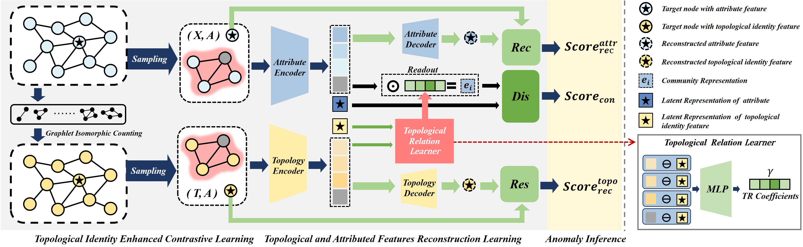

# ANTI: Advancing Anomaly Detection on Attributed Networks via Integrating Topological Identity Information

This is the source code of ICONIP 2024 paper [Advancing Anomaly Detection on Attributed Networks via Integrating Topological Identity Information) (ANTI). 




## Requirments
This code requires the following:
* Python>=3.7
* PyTorch>=1.8.1
* Numpy>=1.19.2
* Scipy>=1.6.2
* Scikit-learn>=0.24.1
* Networkx>=2.5.1
* Tqdm>=4.59.0
* DGL==0.4.0 (Do not use the version which is newer than that !)

## Running the experiments
This is a pre-processing step which calculate topological identity feature of the original datasets. Take Cora dataset as an example:
```
### Step 1: Calculate Topological Identity Feature
python calculateTIF.py --dataset cora
```
After calculate Topological Identity Feature, the datasets with structure feature are saved into "dataset_with_tif" folder
```
### Step 2: Anomaly Detection
This step is to run the HOUSE framework to detect anomalies in the network datasets. Take PubMed dataset as an example:
python run.py --dataset pubmed
```


